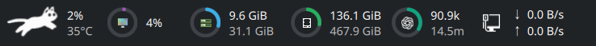

# RunCat for KDE Plasma

RunCat is a Plasma 6 panel widget. Its animated runner moves faster as total CPU
usage increases and rests when the system is idle. It is designed for KDE
Plasma on Wayland and uses Plasma's existing system-monitor sensor, so no
background daemon is required.


## Requirements

- KDE Plasma 6
- `ksystemstats` and the `org.kde.ksysguard.sensors` QML module
- KDE's KQuickCharts and KItemModels QML modules
- Python 3 (for optional local Codex and Claude Code token statistics)
- `kpackagetool6`

Arch Linux provides these through the `plasma-workspace`, `ksystemstats`, and
`libksysguard` packages. Other distributions may split them differently.

## Install

```bash
make install
```

Then open **Add Widgets** on a Plasma panel, search for **RunCat**, and drag it
onto the panel. Choose Cat, Dog, Slime, Drop, Coffee, Newton's Cradle, Engine,
or Mochi from its behavior settings. During development, launch it in a
standalone window with:

```bash
make run
```

Run `make uninstall` to remove the locally installed widget.

After changing the widget, install it and restart Plasma Shell in one command:

```bash
make reload
```

## Components



New installations start with only the Runner. Every component can be added,
removed, configured, and reordered independently:

- **Runner** — An animated character whose speed follows total CPU usage. It
  can optionally show the current CPU usage percentage and CPU temperature in
  Celsius or Fahrenheit; elevated temperatures are color-coded.
- **Memory usage** — The ring shows the percentage of physical memory in use.
  Optional text shows used memory on the first line and total memory on the
  second line.
- **Disk usage** — The ring shows the percentage of combined disk capacity in
  use. Optional text shows used capacity on the first line and total capacity
  on the second line.
- **Network rate** — Shows the current aggregate download rate on the first
  line and upload rate on the second line.
- **GPU usage** — The ring shows aggregate GPU load. Optional text shows the
  current usage percentage. GPU temperature is a separate option, disabled by
  default, and uses the same units and color thresholds as CPU temperature.
- **Video memory usage** — The ring shows the percentage of video memory in
  use. Optional text shows used video memory on the first line and total video
  memory on the second line.
- **Disk I/O** — Shows the current aggregate disk read rate (`R`) on the first
  line and write rate (`W`) on the second line.
- **Codex usage** — The ring shows current context tokens as a percentage of
  the context window. Optional text shows current context tokens on the first
  line and today's total tokens on the second line.
- **Claude Code usage** — Like Codex usage, the ring represents current context
  consumption, with an independently configurable context-window size.
  Optional text shows current context tokens followed by today's total tokens.

Codex and Claude Code usage is read locally from their session logs. No
credentials or prompt contents are sent anywhere.

## Development

Development requires `jq`, `xmllint`, Qt's QML tools, and `zip`.

```bash
make check    # Static checks
make test     # Automated tests
make reload   # Install and restart Plasma Shell
make package  # Build the .plasmoid package
```

Release changes should update `package/metadata.json` and `CHANGELOG.md` before
the version tag is pushed. CI creates the GitHub Release as a draft.

## License

The implementation is licensed under the Apache License 2.0. The bundled runner
frames come from RunCat Neo and retain their original copyright. See `LICENSE`
and `THIRD_PARTY_NOTICES.md`.
